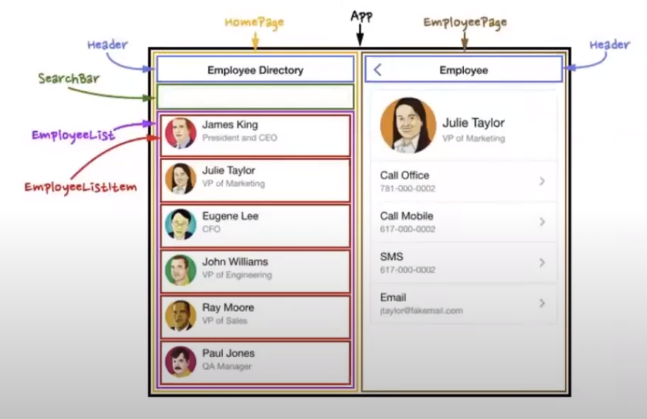
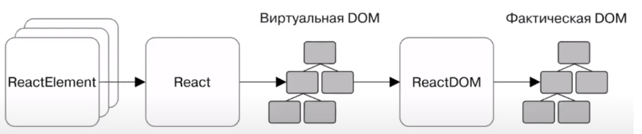
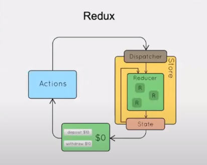
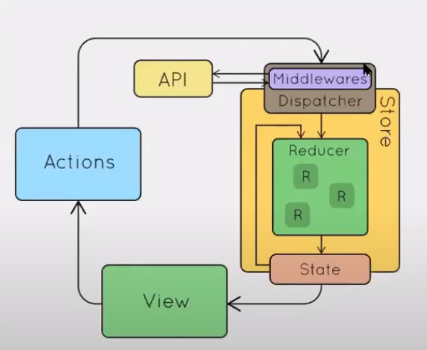

# react-conspects
 A brief introduction to react

# React

## React — это...

JavaScript библиотека (__не фреймворк!__) для создания пользовательских интерфейсов.

## SPA — подход, в котором

+ Используется один html-документ
+ Динамическое обновление, благодаря JavaScript
+ Быстрый отклик (приложение не загружает новые страницы, тем самым напоминая desktop-ное приложение)
+ Простота разработки
+ Возможность работы в offline режиме (благодаря кешированию данных)

## Не все так просто с SPA

+ Долгая первая загрузка
+ Нет поддержки javascript == нет приложения
+ SEO
+ Большая часть взаимодействия на клиенте

## Философия React

### Компонентный подход

### VDOM

React создает свой виртуальный DOM и обрабатывает все взаимодействие с реальным DOM'ом в виртуальным, а затем все появившиеся несоответствия устраняет, путем изменения лишь частей реального DOM'а под виртуальный, тем самым ускоряются операции по работе с объектной моделью документа.

### Как React строит дерево компонентов

Элементы React:

1. __ReactComponentElement__

	`JS Class Component` (ссылка на класс или на функцию компонента)
2. __ReactDOMElement__

	`

, 

` (виртуальное отображение элемента)

### React.CreateElement(...)

	const element = React.CreateElement(
		'h1',
		{ className: 'greeting' },
		'Hello world!'
	);

			| | | | To
			V V V V  JSX

	const element = {
		type: 'h1',
		props: {
			className: 'greeting',
			children: 'Hello world!'
		} 
	};

### JSX

Синтаксический сахар, позволяющий писать компоненты, используя html, а не заполняя поля объектов JavaScript, преобразуются к вызову функции React.CreateElement.

	const element = (
		<h1 className='greeting'>
			Hello world!
		</h1>
	);
			| | | | From
			V V V V  JSX

	const element = React.CreateElement(
		'h1',
		{ className: 'greeting' },
		'Hello world!'
	);

## Практика

### Способы создания компонента

+ Функциональный

		const NameOfElement = () => {
			return 
some text

		}

+ Классовый (устарели)

		class NameOfElement extends React.Components {
			render() {
				return 
some text

			}
		}

### Вмонтирование компонентов

	ReactDOM.render(<NameOfElement />, document.getElementById('root'))

### Работа с состоянием элемента

+ Передача входных параметров (props, только read-only)

	const RootElement = () => {
		return <NameOfElement propertyName="propertyValue" />
	}
	
	const NameOfElement = (props) => {
		return 
{ props.propertyName }

	}

+ Изменение состояния компонента (import {useState} from 'react')
	
	let initialValue = 1;
	const NameOfElement = () => {
		const [property, setProperty] = useState(initialValue);
		setProperty(initialValue + 1);
		return 
property

	}

### Работа с событиями

	const [counter, setCounter] = useState(0)
	const onClickEventHandler = (e) => {
		setCounter(counter + 1)
	}
	return {
		

			<button onClick={ onClickEventHandler }>click</button>
			Counter: { counter }
		

	}

### Условная отрисовка

Выполняется с помощью логического выражения, заключенного в фигурные скобки, обозначающие javascript выражение.

	{ booleanCondition && <Component /> }
	// or
	{ booleanCondition ? <Component /> : <ElseComponent /> }

### Изменение параметров родительских компонентов из дочерних

Для изменения параметров родительских компонентов из дочерних можно передавать в массив свойств дочерних элементов функции изменения состояния свойств родителя и просто осуществлять их вызов.

### Вывод в цикле

	const RootElement = () => {
		return {
			

				{ [1, 2, 4, ].map(
					(el, idx) => <ChildrenElement key={idx} />
				)}
			

		}
	}

## Жизненный цикл

1. __инициализация__ — создание экземпляра класса компонента
	
	setup props and state
2. __монтирование__ — компонент вставляется в DOM

	componentWillMount -> render -> componentDidMount
3. __обновление__ — компонент обновляется новыми данными через состояние или свойства

	props: componentWillReceiveProps -> shouldComponentUpdate (true->) componentWillUpdate -> render -> componentDidUpdate
	states: shouldComponentUpdate (true->) componentWillUpdate -> render -> componentDidUpdate
4. __размонтирование__ — компонент удаляется из DOM

	componentWillUnmount

## React-router

Создаем тег <Router>, в нем определяем <Switch> и цепочку путей (<Route>), в которых в параметрах указываем пути до компонентов, а внутри сами отрисовываемые компоненты

	ReactDOM.render(
		<Router>
			<Switch>
				<Route exact path="/">
					<HomePage />
				</Route>

				<Route path="blog/slug">
					<BlogPost />
				</Route>
			</Switch>
		</Router>
	);

## Axios

Библиотека для организации взаимодействия с сервером, удобная замена стандартного fetch'a или XmlHttpRequest.

	axios.get('/path').then(()=>...).catch(()=>...)
	axios.post('/path', { name, date...}).then(()=>...).catch(()=>...)

# Redux

## А для чего?

Redux - менеджер состояния. Чаще всего используется с React, но не привязан к нему.

## Особенности

+ Общее, одно состояние данных, доступное из любого компонента
+ Состояние изменяется только с помощью action, но не напрямую
+ В компоненте можно подписаться на изменения определенного значения
+ Компоненты могут иметь свое состояние (state), но только если оно важно только для данного компонента
+ ...кода становиться в несколько раз больше

## Store

Объект, который содержит состояние приложенияи является уникальным.

Является неизменяемым — обновляется путем создания нового объекта.

	const store = createStore(initialState, reducer)

+ `getState()`
+ `dispatch(action)`
+ `subscribe(listener)`
+ `replaceReducer(nextReducer)`

## Reducer

Чистая функция, которая вычисляет новое состояние.

	function counterReducer(state = initialState, action) {
		if (action.type === 'counter/increment') {
			return {
				...state,
				value: state.value + 1
			}
		}

		return state;
	}

## Action 

Некоторое событие, которое должно привести к изменению состояния.

С точки зрения js - это любой объект, имеющий идентификатор события (type)

	const addToDo = (name) => ({
		type: 'ADD_TO_DO',
		payload: { name }
	})

## Dispatch

Функция redux, которая генерирует события.

dispatch(action);

## Middleware

Усилители. Главная их суть - принять входные данные действия, обработать и отправить дальше. Часто используется для работы с api

# Настройка окружения

## Начало

Быстрое создание шаблонного приложения для быстрого старта

Разработчики CRA == разработчики React, они знают: как правильно все настроить

Они поддерживают самые актуальные зависимости

Под капотом babel и webpack

	npx create-react-app your-react-title

## npm

NPM — пакетный менеджер для NodeJS

Раньше подключение JS библиотеки выглядело так:

+ Найти и скачать нужную библиотеку в интернете (jquery например)
+ Положить в проект
+ Подключить тегом script в html файле

Или же есть вариант с CDN (Content Delivery Network), тогда скачивать ничего не нужно, но искать все равно надо.

## Основные команды

	npm install <packagename> установить пакет
	npm i --save <pname> установить пакет и сохранить его в package.json
	npm i -g <pname> установить пакет в глобальную область видимости
	npm run start (запустить таргет start)
	~/.npmrc или npm config — конфигурации
